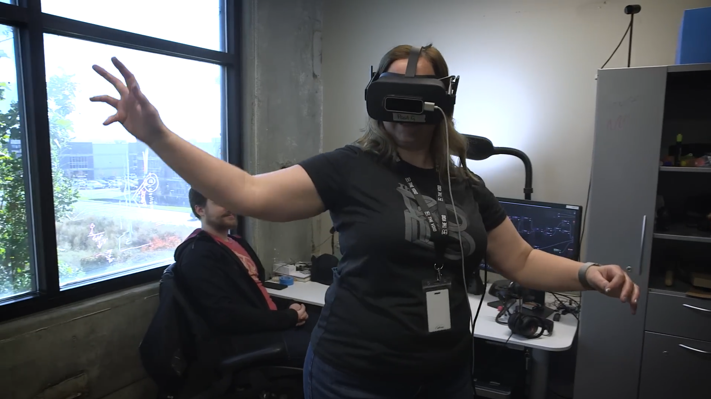

# RAPTURE HMD

The RAPTURE HMD is the connected VR headset intended to run in-tandem with the [RAPTURE Backtop](../hardware/RAPTURE_Backtop.md). 

!!! info "Disclaimer"  
    Three versions of the RAPTURE HMD exist. This page will only cover the "RAPTURE HMD", which is the version used in all VECs after early 2017 containing a modified Oculus Rift CV1. Eventually, there will be documentation covering the DK2 RAPTURE HMD and RAPTURE 2K (curved OLED).

---

# Hardware

The RAPTURE HMD is a semi-custom VR headset designed to run in-tandem with a [RAPTURE Backtop](RAPTURE_Backtop.md). It contains a modified Oculus Rift CV1, Leap Motion hand tracking sensor, OptiTrack Active Markers, and large stereo headphones with inbuilt volume controls.  
The custom shell changes the fitment of the headset from the standard CV1 and allows the front optic module to flip up for onboarding and safety.

[image of HMD, front / semi side view]  
[image of HMD, front view (LM centered)]  
[image of HMD, side view]  
[image of HMD, back view]    
[image of HMD, flipped up state]  
[image of HMD, interior showing lenses] 
 
  

> ###### Back panel of HMD removed revealing OptiTrack active marker and audio PCB.

---

Aside from the custom shell and OptiTrack hardware, RAPTURE HMDs are nothing fancy. You can easily interchange parts between a standard CV1 and the RAPTURE HMD. Standard Rift CV1s were even used during development of games, as shown in some promotional material!

> ###### [Image Credit: The VOID, ILM Immersive (ILMxLAB), Epic Games as Unreal Engine](https://www.youtube.com/watch?v=Q5Ju8315-mc)