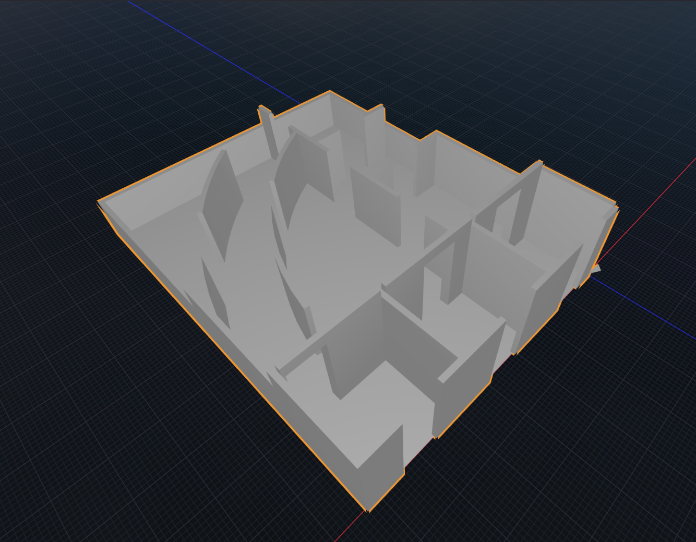

# Glossary of Jargon

The VOID loves using lots of technical  jargon in their marketing and internal communications. This page attempts to document some of the most commonly used terms.  

Eventually, this will be in alphabetical order or something. For now, this is in order of memory.

---

## The VOID

Yes, even The VOID is "jargon"!
The VOID is a ~~backronym~~ acronym for ***The*** ***V***ision ***o***f ***I***nfinite ***D***imensions.

## Dimension / Dimensions

All VOID experiences / games are referred to internally as Dimensions. This can be found inside a [Backtop's](hardware/RAPTURE_Backtop.md) file structure, where the Dimensions folder holds all of the game files for each game.

## Traveler

Refers to a customer / guest stepping into The VOID.

## Stage

The physical set where VOID Dimensions take place. These stages include [OptiTrack](https://optitrack.com) tracking hardware, various physical walls and setpieces, props, DMX environmental FX hardware (fans, compressed air emitters, scent emitters, heat lamps, water misters), [RAPTURE Gun](hardware/RAPTURE_Gun) holsters, and button panels. VOID stages are modular, meaning they can be swapped to the physical designs of another Dimension within a few hours.  
Latest / Final physical design was made by [TAIT Design](https://www.taittowers.com). No public documentation of the partnership between TAIT and The VOID exists (aside from semi-private employee recountings) however TAIT is also connected to JUMP by Limitless Flight [(seen here)](https://www.taittowers.com), a project founded by James Jensen.

  
3D render of a base stage, with no additional walls or props.

